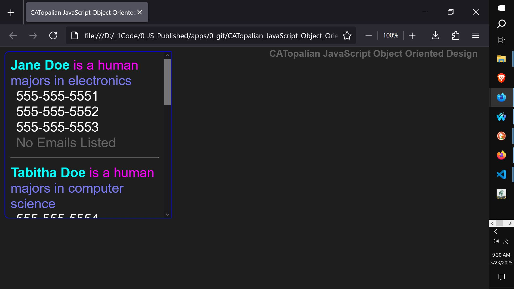

# CATopalian JavaScript Object Oriented Design
An object oriented JavaScript application with code that teaches many important computer science and data science topics.  

USE APP: https://christopherandrewtopalian.github.io/CATopalian_JavaScript_Object_Oriented_Design/CATopalian_JavaScript_Object_Oriented_Design.html  

  

---

### How to Download this App
1. Click the green Code Button on this github page
2. Choose Download ZIP
3. Save the Zip File
4. Extract All
5. Double click the HTML file to start the App

---

Happy Scripting :-)
